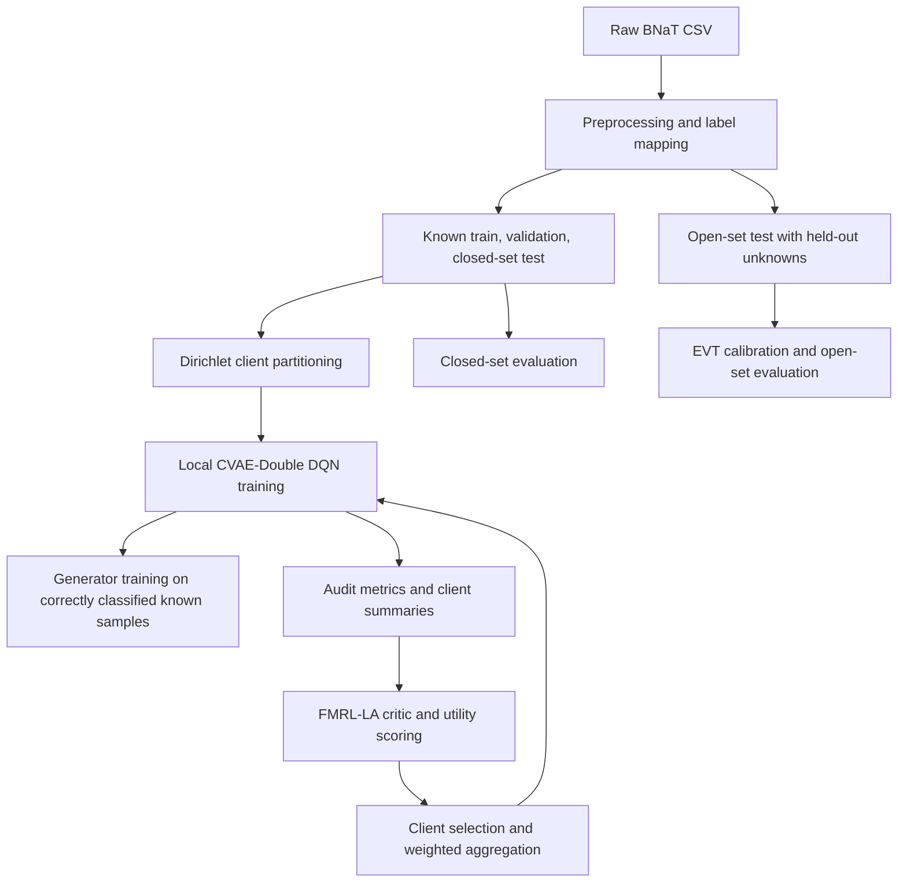

# cf_marlos Experimental Plan for Closed-Set, Open-Set, and Non-IID Federated Intrusion Detection

This plan defines the final evaluation protocol for the unified intrusion-detection system implemented in the `cf_marlos` repository. The system combines CVAE-style latent modeling, Double DQN training, EVT-based open-set rejection, and horizontal federated learning with FedAvg, FedProx, and FMRL-LA. B-NAT is the primary dataset for all core experiments, with frozen preprocessing and seed-controlled client partitions. Closed-set B-NAT experiments use the full source label set with no unknown labels held out; B-NAT open-set experiments keep `FoT` as the held-out unknown attack. A separate multi-dataset open-set non-IID validation block uses the external datasets B-TAT, ToN-IoT, and CIC-IDS2017 only; B-NAT is not repeated in that external-validation experiment.

## 1. Scope and Research Questions

The goal is to show that the full pipeline:

1. Preserves performance in the closed-set setting when all dataset labels are included.
2. Rejects unknown attacks reliably with open-set detection.
3. Improves federated training under non-IID client data.
4. Remains stable when open-set detection and federated non-IID training are combined.
5. Remains effective when independently applied to external datasets with different class distributions, attack categories, traffic characteristics, and dataset-specific shifts.

These questions map directly to the implemented system:

- `PriorNetwork` learns `p_theta(z|s)`.
- `RecognitionNetwork` learns `q_phi(z|s,a)`.
- `MainQNetwork` estimates action values for known classes.
- `GenerationNetwork` reconstructs traffic features from latent and action inputs.
- `EVTModel` converts reconstruction error into an unknown-attack score.
- `AsyncCritic` and `CentralizedAggregator` support FMRL-LA client scoring and aggregation.

## 2. System Under Test

### 2.1 Learning formulation

The intrusion-detection task is treated as a discrete-time MDP:

- `s_t`: traffic feature vector
- `a_t`: predicted class label
- `r_t`: `+1` if the prediction is correct, `-1` otherwise
- transition: sampled independently of the action

The agent uses:

- epsilon-greedy exploration
- experience replay
- Double DQN target selection
- soft target-network updates

The local training objective combines:

- KL divergence for the latent prior
- TD loss for the Q-network
- reconstruction loss for the generator

### 2.2 Open-set decision rule

Open-set detection reuses the same encoder-decoder stack and changes only the decision logic:

1. Predict the class with `argmax_a Q(s, a)`.
2. Reconstruct the sample using the predicted class.
3. Compute reconstruction error.
4. Fit class-conditional EVT tails on correctly classified known-sample errors from validation data.
5. Reject the sample as unknown if the EVT score exceeds the calibrated threshold.

Unknown labels are handled consistently:

- raw unknown labels are stored as `-1`
- the operational unknown class is reported as `99`

### 2.3 Federated coordination

The federated setup is horizontal:

- all clients share the same feature space and output space
- each client trains on a local shard
- the server aggregates updates across clients

The supported strategies are:

- `FedAvg`
- `FedProx`
- `FMRL-LA` (`FMRL_LA` in some source files)

Only the trainable parameter blocks are federated. The target Q-network is synchronized locally after aggregation and is not directly shared as a separate federated object.

FMRL-LA is run as a two-phase round:

1. Phase A: all sampled clients train locally and upload audit metadata.
2. The server scores client utility from latent summaries, reward statistics, accuracy, F1, TD stability, novelty, class entropy, label coverage, generator quality, and local interaction count.
3. A QMIX-style monotonic mixer, conditioned on the padded global client-state vector, turns those signals into aggregation weights.
4. Phase B: selected clients upload cached weights, and the server applies the weighted update.

Each federated baseline should be labeled by the exact local objective used in the run. If the proximal penalty is not active, report that configuration separately instead of treating it as a fully regularized FedProx result.

## 3. Experimental Variables and Controls

| Type        | Variable              | Settings                                                      |
| ----------- | --------------------- | ------------------------------------------------------------- |
| Independent | Inference mode        | Closed-set only, open-set enabled                             |
| Independent | Federation strategy   | Local training, FedAvg, FedProx, FMRL-LA                      |
| Independent | Data heterogeneity    | IID closed-set over all labels, Dirichlet non-IID with alpha values 0.01, 0.5, and 1.0  |
| Independent | Unknown composition   | Leave-one-attack-out or multi-unknown holdout                 |
| Independent | Dataset benchmark     | B-NAT for core experiments; B-TAT, ToN-IoT, and CIC-IDS2017 for external validation only |
| Independent | Random seed           | Fixed seed list, reused across all methods                    |
| Dependent   | Closed-set quality    | Accuracy, macro F1, balanced accuracy, per-class scores       |
| Dependent   | Open-set quality      | AUROC, AUPRC, FPR@95%TPR, unknown F1, rejection rate          |
| Dependent   | Federated quality     | Final accuracy, convergence speed, stability, client variance |
| Dependent   | Efficiency            | Training time, communication cost, rounds to convergence      |
| Controlled  | Dataset version       | Frozen registry entry and checksum                            |
| Controlled  | Dataset-specific label map | Known/unknown mapping fixed before each dataset run       |
| Controlled  | Preprocessing         | Same scaler, encoder, label map, and feature schema           |
| Controlled  | Split protocol        | Same train/validation/test split across all runs              |
| Controlled  | Threshold calibration | Validation only; never on the test set                        |
| Controlled  | Training budget       | Same epochs, rounds, batch size, and optimizer settings       |
| Controlled  | Client partition      | Same seed-specific partition for every method in a comparison |

The main rule is simple: every method in a comparison must see the same data split, the same seed, and the same preprocessing contract.

## 4. Data Preparation and Label Contract

### 4.1 Dataset roles

1. **B-NAT**
   Primary experimental dataset. The classes `Normal`, `DoS`, `FoT`, `MitM`, and `BP` are explicitly referenced in the source plan and plotting logic. B-NAT is used for the main IID, non-IID, open-set, ablation, efficiency, and robustness experiments.
2. **B-TAT**
   External benchmark dataset with eight total classes in the source plan. The known/unknown class mapping must be finalized before execution. This dataset is used only in the multi-dataset open-set non-IID validation experiment.
3. **ToN-IoT**
   External benchmark dataset with nine total classes in the source plan. The known/unknown class mapping must be finalized before execution. This dataset is used to evaluate the proposed model on heterogeneous IoT-device traffic under open-set and non-IID conditions.
4. **CIC-IDS2017**
   External benchmark dataset with fourteen total classes in the source plan. The known/unknown class mapping must be finalized before execution. This dataset is used as an industry-standard benchmark to further validate model generalization under open-set and non-IID settings.

### 4.2 Dataset handling

Each raw dataset is transformed into tensor datasets through the following steps:

1. Detect numeric and categorical columns.
2. For closed-set experiments, map all source labels to contiguous integer classes.
3. For open-set experiments, keep the unknown labels out of the training set.
4. Fit scaling and encoding only on the training portion.
5. Build closed-set train, validation, and test tensors from the full source label set.
6. Build an open-set test tensor by combining known test samples with held-out unknown samples when the open-set protocol is active.
7. Partition the known training data into client shards with Dirichlet sampling.

### 4.3 Stored artifacts

The preprocessing stage should produce:

- `known_train.pt`
- `validation.pt`
- `closed_set_test.pt`
- `open_set_test.pt`
- `shared_closed_set_test.pt`
- `shared_open_set_test.pt`
- `client_<id>_train.pt`

The shared tensors are used for global evaluation and figure generation. The client tensors are used for local and federated training.

### 4.4 Non-IID partitioning

Client partitions are sampled with a Dirichlet distribution over class labels:

`p_c ~ Dirichlet(alpha * 1_n)`

Smaller `alpha` values produce stronger class skew. All clients still share the same global action space, so a client may be missing some classes locally without changing the model output dimension.

## 5. Experimental Matrix

| ID  | Experiment                   | Main question                                                                   | Main baseline(s)                                                                                                   | Main outputs                                                         |
| --- | ---------------------------- | ------------------------------------------------------------------------------- | ------------------------------------------------------------------------------------------------------------------ | -------------------------------------------------------------------- |
| E1  | Closed-set validation        | Does the full model preserve performance when all labels are treated as closed-set classes? | Centralized training, local-only, FedAvg, FedProx                                                                  | Accuracy, macro F1, balanced accuracy, convergence                   |
| E2  | Open-set detection           | Can unknown attacks be rejected without hurting known classes?                  | Closed-set classifier without EVT, softmax-only baseline                                                           | AUROC, AUPRC, FPR@95%TPR, unknown F1, confusion matrices             |
| E3  | Federated non-IID comparison | Does FMRL-LA outperform standard federated methods under heterogeneous clients? | FedAvg, FedProx, local-only                                                                                         | Final accuracy, stability, convergence speed, communication cost     |
| E4  | Combined open-set + non-IID  | Does the full system remain effective when both challenges are active?          | Closed-set classifier without EVT, softmax-only baseline, FedAvg, FedProx, local-only                               | Known-class metrics, unknown metrics, per-client robustness          |
| E5  | Multi-dataset open-set non-IID validation | Does the method remain effective when trained and evaluated separately on external benchmarks under open-set and non-IID conditions? | Per-dataset FMRL-LA, FedAvg, FedProx, and local-only runs on B-TAT, ToN-IoT, and CIC-IDS2017 | Per-dataset closed/open metrics, robustness, and consistency across datasets |
| E6  | Ablation and sensitivity     | Which module contributes most to the gains?                                     | Base model, no EVT, no generator, FedAvg, FedProx, FMRL-LA                                                         | Metric deltas, threshold sensitivity, seed stability                 |
| E7  | Efficiency and scalability   | How does performance change with more clients and more rounds?                  | FedAvg vs FMRL-LA                                                                                                  | Runtime, bytes transmitted, rounds to convergence, accuracy per cost |
| E8  | Label-wise open-set stress test | Can the detector separate each held-out label from the remaining labels?      | IID open-set run, FedAvg open-set run, per-label latent export                                                  | AUROC, AUPRC, unknown F1, latent-space separation                    |

## 6. Detailed Experimental Protocols

### 6.1 E1: Closed-Set Validation

**Purpose:** verify that the closed-set pipeline preserves classification quality across the full label set.

**Setup**

- Train on the full B-NAT label set.
- Evaluate on the closed-set test tensor.
- Compare local-only training, FedAvg, FedProx, and FMRL-LA under the same split. Centralized pooled commands are retained in the scripts as commented reference baselines only.
- Report both global averages and per-class results.

**Metrics**

- accuracy
- macro precision
- macro recall
- macro F1
- weighted F1
- balanced accuracy
- per-class confusion matrices

**Expected outcome**

- The full model should match or exceed the closed-set baseline within normal run-to-run variation.
- The addition of open-set components should not introduce a meaningful drop in known-class performance.

### 6.2 E2: Open-Set Detection

**Purpose:** verify that the model can identify unknown attacks while keeping known-class behavior intact.

**Setup**

- Fit EVT only on correctly classified known samples from validation data.
- Use leave-one-attack-out or multi-unknown holdout evaluation.
- Compare the full EVT-based detector with a closed-set classifier that always returns the argmax class.
- Report both known-class and unknown-class behavior on the same test set.

**Metrics**

- AUROC
- AUPRC
- FPR@95%TPR
- TPR@5%FPR
- unknown F1
- unknown rejection rate
- known-class accuracy after rejection

**Expected outcome**

- Unknown samples should receive higher EVT scores than known samples.
- Rejection should improve unknown detection without materially harming known-class accuracy.

### 6.3 E3: Federated Non-IID Comparison

**Purpose:** test whether FMRL-LA improves training stability and final performance under client heterogeneity.

**Setup**

- Generate client shards with multiple Dirichlet alpha values: 0.01, 0.5, and 1.0 over the full label set.
- Run the same training budget for all strategies.
- Compare FedAvg, FedProx, local-only training, and FMRL-LA. Centralized pooled commands are retained in the scripts as commented reference baselines only.
- Use the same client sampling fraction, seed list, and local epoch count for every run.

**Metrics**

- final accuracy
- final-10-round mean accuracy
- maximum accuracy
- macro F1
- convergence rounds
- per-seed variance
- client-wise performance spread
- communication cost
- reward trajectory for the RL component

**Expected outcome**

- FMRL-LA should be more stable than FedAvg and FedProx when alpha is small.
- The performance gap should widen as the data become more skewed.

### 6.4 E4: Open-Set Detection Under Non-IID Conditions

**Purpose:** evaluate the full system when unknown-attack rejection and federated heterogeneity are both present.

**Setup**

- Use the same Dirichlet partitions from E3.
- Calibrate EVT thresholds on validation data only.
- Evaluate on mixed known/unknown test tensors.
- Report both global results and per-client results.

**Metrics**

- known-class accuracy
- known-class macro F1
- AUROC
- AUPRC
- FPR@95%TPR
- unknown F1
- per-client detection variance

**Expected outcome**

- The detector should still reject unknowns under client skew.
- Performance should degrade gracefully relative to the IID open-set case.

### 6.5 E5: Multi-Dataset Open-Set Non-IID Validation

**Purpose:** evaluate whether the proposed model remains effective when independently applied to external datasets under realistic open-set and non-IID conditions.

**Setup**

- Use B-TAT, ToN-IoT, and CIC-IDS2017 only. Do not repeat B-NAT in this experiment block.
- Train, tune, and evaluate the model separately on each external dataset. This is not a cross-dataset transfer experiment.
- Finalize the known/unknown class mapping for each dataset before execution and keep that mapping fixed for all methods compared on that dataset.
- For each dataset, build its own train, validation, closed-set test, open-set test, and Dirichlet client partitions.
- Reuse the same evaluation logic as the main B-NAT open-set non-IID protocol: validation-only EVT calibration, matched budgets across methods, and per-dataset non-IID client splits.

**Metrics**

- per-dataset accuracy
- macro F1
- balanced accuracy
- AUROC
- AUPRC
- FPR@95%TPR
- unknown F1
- per-dataset convergence stability
- communication cost

**Expected outcome**

- The method should remain competitive on each external dataset despite differences in traffic characteristics and label structure.
- Performance differences across B-TAT, ToN-IoT, and CIC-IDS2017 should be interpreted as dataset-specific difficulty, not as evidence of transfer failure, because each dataset is trained and evaluated independently.

### 6.6 E6: Ablation and Sensitivity

**Purpose:** isolate the contribution of each major module.

**Ablations**

- remove EVT rejection
- remove generator training
- replace the latent CVAE-style branch with a direct classifier
- replace FMRL-LA with FedAvg
- replace FMRL-LA with FedProx
- disable client selection and aggregate all uploaded models

**Sensitivity checks**

- Dirichlet alpha sweep over 0.01, 0.5, and 1.0
- EVT threshold sweep
- random-seed sweep
- client-count sweep

**Expected outcome**

- Each removed component should cause a measurable drop in the metric it is designed to improve.
- The full model should be the most balanced configuration across closed-set accuracy, open-set rejection, and federated stability.

### 6.7 E7: Efficiency and Scalability

**Purpose:** quantify the cost of the method as the number of clients and rounds changes.

**Setup**

- vary the number of clients
- vary the communication-round budget
- compare FedAvg and FMRL-LA under the same training settings

**Metrics**

- wall-clock time
- bytes transmitted
- rounds to convergence
- accuracy per round
- accuracy per megabyte

**Expected outcome**

- FMRL-LA may add coordination overhead, but the selected-client update path should improve utility per round under non-IID data.

### 6.8 E8: Label-Wise Open-Set Stress Test

**Purpose:** demonstrate open-set separation when one source label is held out at a time and the latent tensor is saved per run.

**Setup**

- Hold out one source label per run.
- Keep the remaining labels in the known set for that run.
- Run the IID open-set configuration and the FedAvg open-set configuration for each held-out label.
- Export latent embeddings from the active open-set evaluation tensor only, without duplicating closed-set rows.

**Metrics**

- AUROC
- AUPRC
- FPR@95%TPR
- unknown F1
- known accuracy after rejection
- latent-space class separation

**Expected outcome**

- Known samples should form a tighter cluster than the unknown samples in latent space.
- Unknown rejection should remain stable as the held-out label changes.
- The latent-space proof for this experiment should be the canonical figure source for the paper.

## 7. Detailed Training and Evaluation Workflow

### Workflow rules

1. Freeze the dataset registry before any training starts.
2. Fit all preprocessing objects only on training data.
3. Reuse the same split and partition for every method in a comparison.
4. Calibrate EVT thresholds only on validation data.
5. Run every strategy with the same seed list.
6. Save checkpoints, metrics, logs, and generated figures for every run.
7. Do not aggregate results until all runs for a comparison block are complete.
8. For E5, repeat the full train/tune/evaluate cycle independently per external dataset; do not mix datasets and do not treat the block as cross-dataset transfer.

## 8. Metric Families and Statistical Analysis

| Family                    | Metrics                                                                            |
| ------------------------- | ---------------------------------------------------------------------------------- |
| Closed-set classification | Accuracy, macro precision, macro recall, macro F1, weighted F1, balanced accuracy  |
| Open-set detection        | AUROC, AUPRC, FPR@95%TPR, TPR@5%FPR, unknown F1, rejection rate                    |
| Federated learning        | Final accuracy, best accuracy, final-10 average, convergence rounds, seed variance |
| Efficiency                | Runtime, communication cost, accuracy per MB, rounds to convergence                |
| Robustness                | Per-seed dispersion, alpha sensitivity, client-count sensitivity                   |

### Reporting rules

- Report mean, standard deviation, and 95% confidence intervals.
- Use paired comparisons when methods share the same split and seed.
- Use Wilcoxon signed-rank tests when the normality assumption is weak.
- Use paired t-tests only when normality is acceptable.
- Apply a multiple-comparison correction when several pairwise tests are reported.
- Include effect sizes together with p-values.

## 9. Reporting Package

The final report should contain:

- one results table per experiment block
- one plot set per experiment block
- one summary table for statistical significance
- one reproducibility log with commands, seeds, and output paths
- one appendix plot set for supplementary figures

### Recommended figure groups

- E1: accuracy, precision/recall/F1, and convergence plots
- E2: confusion matrices, ROC curve, and open-set metric summary
- E3: client distribution, reward evolution, and federated convergence plots
- E4: combined robustness and per-client detection plots
- E5: per-dataset summary bars, open-set metric tables, and convergence plots for B-TAT, ToN-IoT, and CIC-IDS2017
- E6: ablation bars and sensitivity sweeps
- E7: runtime and communication-efficiency plots
- E8: Label-wise latent-space separation and open-set proof plots

## 10. Final Execution Checklist

- [ ] Dataset registry completed and checksum-verified
- [ ] Label mapping frozen
- [ ] Known train, validation, and test splits saved
- [ ] Dirichlet client partitions generated and archived
- [ ] Closed-set runs completed for all strategies over the full label set
- [ ] Open-set runs completed with validation-only calibration
- [ ] Federated non-IID runs completed across alpha values
- [ ] Combined open-set + non-IID runs completed
- [ ] External validation runs completed separately for B-TAT, ToN-IoT, and CIC-IDS2017
- [ ] Ablation runs completed
- [ ] Efficiency and scalability runs completed
- [ ] Label-wise open-set stress-test runs completed
- [ ] Tables filled from logged metrics
- [ ] Figures regenerated from saved outputs
- [ ] Statistical tests reported
- [ ] Final manuscript-ready summary assembled

## 11. Summary of Expected Results

The final system should show eight consistent results:

1. Closed-set metrics remain strong after open-set capability is added.
2. EVT rejection separates unknown attacks from known traffic with strong threshold-independent performance.
3. FMRL-LA is more robust than FedAvg and FedProx under non-IID client partitions.
4. The combined system remains usable when both open-set detection and federated heterogeneity are active at the same time.
5. The external validation block shows that the method remains effective when trained and evaluated separately on B-TAT, ToN-IoT, and CIC-IDS2017 under open-set and non-IID conditions.
6. Ablation and sensitivity results isolate the value of EVT, generator training, client selection, and utility-aware aggregation.
7. Efficiency results quantify the coordination cost of FMRL-LA relative to the accuracy and robustness it preserves.
8. The label-wise open-set stress test cleanly separates each held-out label from the known set in the latent-space proof.
