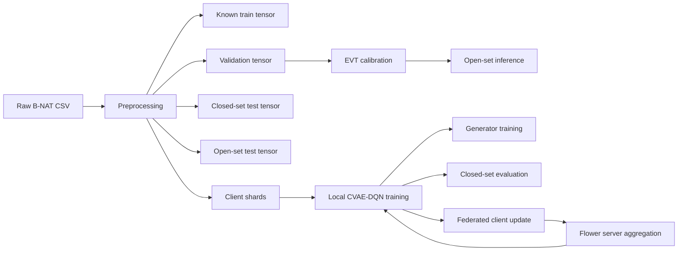

# cf_marlos Research and Engineering Documentation Package

This document consolidates the current research method, system design, algorithms, implementation details, and validation status for the `cf_marlos` repository snapshot under `D:\Research\cf_marlos`.

[ASSUMPTION] This report is the canonical narrative for the current code base and supersedes the more fragmented supporting notes in `docs/evaluation.md`, `docs/federated-learning.md`, `docs/cf_marlos-fmrl-ava-adaptation.md`, `docs/cf_marlos-experiment-plan.md`, `docs/reproducibility.md`, `docs/checkpoints.md`, `docs/logging.md`, `docs/plots.md`, `docs/hydra-experiment-execution.md`, and the `docs/runbooks/` files.

[TODO] Final manuscript claims still require full benchmark runs, cross-seed aggregation, and the external dataset pipeline described in the runbook.

## Traceability

Primary source anchors used for this consolidation:

- `src/data/preprocessing.py`
- `src/rl/environment.py`
- `src/rl/local_training.py`
- `src/agents/agent.py`
- `src/models/models.py`
- `src/evaluation/openset_eval.py`
- `src/openset/evt.py`
- `src/federated/client.py`
- `src/federated/server.py`
- `src/federated/server_models.py`
- `src/federated/run.py`
- `src/training/centralized.py`
- `src/evaluation/run.py`
- `src/evaluation/closed_set.py`
- `src/checkpointing/checkpoints.py`
- `src/artifacts/communication.py`
- `src/artifacts/suite.py`
- `src/artifacts/embeddings.py`
- `src/tracking/local.py`

Supporting documentation reviewed:

- `README.md`
- `docs/evaluation.md`
- `docs/federated-learning.md`
- `docs/cf_marlos-fmrl-ava-adaptation.md`
- `docs/fmrl-ava-source-mapping-fa.md`
- `docs/cf_marlos-experiment-plan.md`
- `docs/reproducibility.md`
- `docs/checkpoints.md`
- `docs/logging.md`
- `docs/plots.md`
- `docs/hydra-experiment-execution.md`
- `docs/runbooks/all-suite.md`
- `docs/runbooks/validation-tiny.md`
- `docs/tiny-experiment-validation.md`

---

## 1. Project Overview

### Problem Statement

The project addresses intrusion detection for B-NAT blockchain traffic under two coupled difficulties:

1. Known-class classification must remain accurate for the classes used in the closed-set system.
2. The detector must reject unknown or unseen attacks without collapsing known-class behavior.
3. The learning pipeline must remain usable under horizontal federated training with non-IID client partitions.

The implementation combines a CVAE-style latent model, Double DQN learning, EVT-based open-set rejection, and federated optimization through FedAvg, FedProx, and FMRL-AVA.

### Research Objectives

1. Preserve closed-set performance after open-set detection is added.
2. Improve robustness against unknown attacks and out-of-distribution traffic.
3. Improve federated training stability under non-IID client data.
4. Validate that the unified system remains operational end-to-end across preprocessing, training, calibration, evaluation, and reporting.

### Scope

The current repository is centered on B-NAT and the labels `Normal`, `BP`, `DoS`, and `MitM` as known classes, with `FoT` treated as the held-out unknown attack. The final manuscript protocol also reserves an external validation block for B-TAT, ToN-IoT, and CIC-IDS2017 once dataset-specific label maps are finalized.

[ASSUMPTION] Final paper runs use 10 clients and 100 logical federated rounds, even though the development defaults in `src/configs` are smaller for local iteration.

The current scope includes:

- raw CSV preprocessing and tensor artifact generation
- known-class closed-set training
- EVT-calibrated open-set rejection
- Flower-based horizontal federated learning
- FedAvg, FedProx, and FMRL-AVA
- artifact generation for plots, tables, and run tracking

Out of scope for this repository snapshot:

- fully automated dataset-specific preprocessing configs and label maps for B-TAT, ToN-IoT, and CIC-IDS2017
- packet-level transport instrumentation
- formal statistical reporting of the full manuscript sweep

### Motivation

The baseline closed-set system is not sufficient for security settings because unknown traffic can be mapped into an existing class with high confidence. The added open-set path gives the model a rejection mechanism, while the federated layer lets the same learning stack operate under data silos and heterogeneous partitions.

---

## 2. System Design

### Overall Architecture

The repository implements a layered pipeline:

1. Raw traffic preprocessing.
2. Local RL-style training of the CVAE-DQN agent.
3. Open-set calibration using reconstruction error and EVT.
4. Horizontal federated aggregation with Flower.
5. Local tracking, checkpointing, and artifact export.



### Components and Modules

| Layer | Main modules | Role |
|---|---|---|
| Data | `src/data/preprocessing.py`, `src/data/io.py` | Read raw CSV, transform features, split known/unknown data, write tensor datasets |
| RL core | `src/rl/environment.py`, `src/rl/replay_buffer.py`, `src/rl/local_training.py`, `src/agents/policy.py`, `src/agents/agent.py` | Define the intrusion MDP, replay, epsilon-greedy policy, and local training logic |
| Models | `src/models/models.py` | Build prior, recognition, Q, target-Q, and generator networks |
| Open-set | `src/openset/evt.py`, `src/evaluation/openset_eval.py` | Fit EVT tails, calibrate thresholds, evaluate unknown rejection |
| Federated | `src/federated/client.py`, `src/federated/server.py`, `src/federated/server_models.py`, `src/federated/run.py` | Run FedAvg, FedProx, and FMRL-AVA in Flower |
| Evaluation | `src/evaluation/closed_set.py`, `src/evaluation/run.py`, `src/evaluation/compare.py` | Compute closed-set, open-set, and run-comparison outputs |
| Artifacts | `src/artifacts/communication.py`, `src/artifacts/suite.py`, `src/artifacts/embeddings.py` | Export communication cost, suite CSVs, and latent projections |
| Support | `src/checkpointing/checkpoints.py`, `src/tracking/local.py`, `src/utils/utils.py`, `src/utils/config.py` | Checkpoints, logging, reproducibility, device and config validation |

### Module Hierarchy

```text
src/
  data/
  rl/
  agents/
  models/
  openset/
  evaluation/
  federated/
  training/
  checkpointing/
  artifacts/
  plotting/
  tracking/
  utils/
  configs/
scripts/
docs/
tests/
```

### Interfaces

| Interface | Input | Output | Notes |
|---|---|---|---|
| `run_preprocessing` | Raw CSV, known labels, partition config | Tensor datasets, scaler/encoder, metadata, manifests | Fits transforms on train split only |
| `run_local_training_round` | Agent, environment, replay buffer, policy, scheduler | Training metrics, interaction counts | Uses proximal penalty when FedProx is active |
| `FlowerClient.fit` | Federated parameters and phase config | Updated parameters or cached audit payload | Implements standard and two-phase FMRL-AVA behavior |
| `fit_evt_models` | Calibration tensors and encoder-decoder stack | Per-class EVT models | Uses correctly classified known samples only |
| `evaluate_open_set` | Open-set test tensor and EVT metadata | Unknown scores, confusion matrices, open-set metrics | Missing EVT tails are treated as unknown |
| `build_suite_artifacts` | Run directories | Suite CSVs and manifest | Used for plot and manuscript aggregation |

### Deployment Structure

The repository supports two execution modes:

1. In-process Flower simulation through `scripts/federated_train.py` and `src/federated/run.py`.
2. Manual server/client execution through `scripts/federated_server.py` and `scripts/federated_client.py`.

`scripts/reproduce_experiment.py` is the orchestration entry point for the full pipeline: preprocessing, federated training, and evaluation.

### Design Decisions and Tradeoffs

| Decision | Rationale | Tradeoff |
|---|---|---|
| CVAE-style latent encoding plus Double DQN | Separates state encoding, action scoring, and reconstruction-based rejection | More moving parts than a plain classifier |
| Reconstruction-error EVT rejection | Provides a calibrated unknown score rather than a raw softmax confidence | Sensitive to calibration quality and tail size |
| Generator trained only on correctly classified known samples | Prevents label contamination in the reconstruction model | Reduces the effective generator training set |
| Validation-based EVT calibration | Avoids test leakage | Requires a dedicated validation split |
| Flower-based federation | Matches the current code base and keeps local simulation reproducible | Adds runtime dependency on Flower |
| FMRL-AVA vector-aligned utilities | Combines FMRL-LA's two-phase critics/mixer with FedAWA's client-vector aggregation idea | More server bookkeeping: selected-client deltas, cosine alignment, critics, mixer, and validation/support monitoring |

### Scalability Considerations

The design scales primarily along three axes:

1. Client count. The preprocessing and FL configs must agree on `num_clients`.
2. Round count. FMRL-AVA uses two Flower rounds per logical round, so its physical communication cost is higher.
3. Model size. The full checkpoint includes prior, recognition, main Q, target Q, and generator weights.

Communication cost is summarized by `src/artifacts/communication.py`, which estimates transfer volume from checkpoint parameter bytes and FMRL-AVA selection records.

---

## 3. Methods

### Research Methodology

The project uses an implementation-driven experimental methodology:

1. Formalize the intrusion detection task as a discrete-time MDP.
2. Implement the RL and open-set pipeline from the paper excerpts.
3. Extend the system to horizontal federated learning.
4. Audit the source code with targeted tests.
5. Validate outputs through metrics, checkpoints, and plotting artifacts.

The current code base is therefore both a model implementation and a reproducibility package.

### Core Mathematical Formulation

Let `s_t` be a traffic feature vector and `a_t` the predicted class action.

Reward:

`r_t = +1` if `a_t = a_t^*`, otherwise `r_t = -1`

Double DQN target:

`y_t = r_t + gamma * Q_target(s_{t+1}, argmax_a Q_main(s_{t+1}, a))`

FedProx local objective:

`F_i^prox(w) = F_i(w) + (mu / 2) * ||w - w_k||^2`

FMRL-AVA vector-aligned weighted aggregation:

`b_i = n_i u_i`

`d_ref = sum_i b_i (w_i - w_k) / sum_i b_i`

`m_i = clip(exp(kappa * cos(w_i - w_k, d_ref)), m_min, m_max)`

`w_{k+1} = w_k + eta * sum_i b_i m_i (w_i - w_k) / sum_i b_i m_i`

Open-set score:

`e(x) = MSE(x, x_hat) * scale`

`P_unknown = GPD_CDF(max(0, e(x) - u))`

Reject when `P_unknown >= delta_global`.

### Data Processing Pipeline

1. Load the raw B-NAT CSV.
2. Infer numeric and categorical feature columns unless they are explicitly configured.
3. Map known labels to contiguous integer ids.
4. Keep unknown labels out of the training pool.
5. Split known data into train, validation, and closed-set test sets.
6. Fit scaling and encoding on the training split only.
7. Build tensor datasets and client shards.
8. Append unknown samples to the open-set evaluation tensor.

Outputs written by preprocessing include:

- `known_train.pt`
- `validation.pt`
- `closed_set_test.pt`
- `shared_closed_set_test.pt`
- `open_set_test.pt`
- `shared_open_set_test.pt`
- `client_<id>_train.pt`
- `class_names.json`
- `partition_manifest.jsonl`
- `client_class_distribution.csv`
- `preprocess_metadata.json`

### Experimental Setup

The implementation currently targets:

- Dataset: B-NAT
- Known classes: `Normal`, `BP`, `DoS`, `MitM`
- Unknown class: `FoT`
- Default model state dimension: `31`
- Default latent dimension: `32`
- Default known-class output dimension: `4`
- Loss and optimization: KL loss, TD loss, MSE reconstruction loss
- Open-set calibration: EVT with validation-based thresholding

[ASSUMPTION] The final paper-level experiments use 10 clients, hard non-IID alpha 0.1, and 100 logical federated rounds, matching the runbook rather than the lighter development defaults.

### Training Flow

The local learning loop alternates three updates:

1. Prior-network KL update against the recognition network on true labels.
2. Recognition-network and main-Q TD update on replayed transitions.
3. Optional generator update on correctly classified known samples.

The environment is intentionally not a classical action-dependent MDP transition system. The next state is sampled independently from the current action, which matches the data-pool formulation used in the code.

### Inference Flow

Closed-set inference:

1. Compute the prior latent mean from `s`.
2. Predict the class using `argmax_a Q(s, a)`.
3. Report the known-class label directly.

Open-set inference:

1. Predict the class as above.
2. Reconstruct the feature vector using the predicted class.
3. Compute the reconstruction error.
4. Convert the error to an EVT unknown score.
5. Reject the sample when the score exceeds the calibrated global threshold.

### Evaluation Methodology

The evaluation pipeline reports three families of metrics:

1. Closed-set metrics: accuracy, balanced accuracy, macro precision, macro recall, macro F1, per-class accuracy.
2. Open-set metrics: AUROC, AUPRC, FPR@95%TPR, unknown F1, unknown detection rate, known accuracy after rejection.
3. Federated metrics: round-level losses and accuracies, communication cost, selected-client ratios, and utility traces.

The open-set calibration is fit on `validation.pt` and now requires that validation split to exist; the run aborts if the file is missing.

### Validation Process

The implementation is validated by a mixture of unit tests and artifact checks:

- `tests/test_agent_fedprox.py` verifies that FedProx produces a nonzero proximal penalty after local drift.
- `tests/test_openset.py` verifies EVT tail behavior, missing-tail rejection, and config-driven open-set ids.
- `tests/test_config.py` verifies config wiring, including `known_train.pt` and `validation.pt`.
- `tests/test_fmrl_ava_strategy.py` verifies that FMRL-AVA uses two Flower rounds per logical round.

The repository also includes smoke tests and plotting tests for end-to-end artifact generation.

### Inputs, Outputs, Assumptions, Limitations

| Category | Content |
|---|---|
| Inputs | Raw B-NAT CSV, Hydra config, seed, client count, open-set calibration data, federated strategy |
| Outputs | Tensor datasets, checkpoints, metrics JSON/CSV, EVT models, open-set score files, plots, communication estimates |
| Assumptions | Known labels are fixed to `Normal`, `BP`, `DoS`, `MitM`; `FoT` is the unknown holdout; the evaluation threshold is calibrated on validation data |
| Limitations | External dataset configs are not yet implemented; final benchmark numbers are not yet frozen; communication cost is estimated, not packet-captured |

---

## 4. Algorithms

### 4.1 Preprocessing and Client Partitioning

**Purpose:** Convert raw B-NAT records into model-ready tensors and create known-class and client-specific splits.

**Inputs:** raw CSV, known labels, unknown label id, seed, `num_clients`, `alpha`, `iid`, train/validation/test proportions.

**Outputs:** tensor datasets, scaler/encoder, class mapping, partition manifest, client distribution summary.

**Procedure:** infer feature types, split known samples, fit transforms on the training split, encode features, write known/open tensors, and partition the training set across clients.

**Pseudocode:**

```text
Algorithm PreprocessAndPartition
Input: raw_csv, known_labels, num_clients, alpha, seed
Load dataframe D
Split D into D_known and D_unknown
Split D_known into train, validation, test
Fit scaler and encoder on train only
Transform train, validation, test to tensors
Write known_train.pt, validation.pt, closed_set_test.pt, shared_closed_set_test.pt
If D_unknown is not empty:
    Transform D_unknown and append to open_set tensors
Partition train labels into client shards using Dirichlet(alpha) or IID split
For each client:
    write client_i_train.pt
Write class_names.json, partition_manifest.jsonl, client_class_distribution.csv, preprocess_metadata.json
```

**Complexity:** `O(N * D)` for feature transforms plus `O(N)` for partitioning, where `N` is sample count and `D` is feature dimension.

**Dependencies:** `src/data/preprocessing.py`, `pandas`, `scikit-learn`, `torch`, `joblib`.

---

### 4.2 Intrusion-Detection Environment Step

**Purpose:** Model the intrusion task as a sampled data-pool MDP for RL training.

**Inputs:** processed tensor dataset, step budget, optional client indices, optional global action count.

**Outputs:** state observations, reward, termination flags, sample metadata.

**Procedure:** sample episode indices with replacement, expose the current feature vector as the state, compute configurable symmetric or class-balanced reward from the predicted action, and advance to the next sampled record.

**Pseudocode:**

```text
Algorithm EnvStep
Input: current_state_index, action
true_label <- label[current_state_index]
reward <- class_weight[label] * (+1 if action == true_label else -1)
advance episode step
if episode is not finished:
    next_state <- feature[next_sample_index]
else:
    next_state <- zero vector
return next_state, reward, terminated, truncated, info(true_label, index)
```

**Complexity:** `O(1)` per step after the episode indices are sampled.

**Dependencies:** `src/rl/environment.py`, `gymnasium`, `torch`.

---

### 4.3 Local CVAE-DQN Training Round

**Purpose:** Update the prior network, recognition network, and main Q-network using replayed local experience.

**Inputs:** agent, environment, replay buffer, epsilon policy, epsilon scheduler, training config, proximal coefficient.

**Outputs:** round metrics such as reward, TD loss, KL loss, auxiliary CE loss, proximal loss, prototype loss, Q statistics, balanced policy accuracy, per-class policy accuracy, and action histograms.

**Procedure:** interact with the environment for a fixed number of episodes, push transitions into replay memory, and repeatedly sample mini-batches for KL and TD updates. The target network is soft-updated during training.

**Pseudocode:**

```text
Algorithm LocalCvaeDqnRound
Input: agent, env, buffer, policy, scheduler, cfg, proximal_mu
for episode in 1..local_episodes_per_round:
    s <- env.reset(seed + episode)
    for step in 1..steps_per_episode:
        epsilon <- scheduler.get_epsilon()
        a <- epsilon_greedy(policy, s, epsilon)
        s_next, r, terminated, truncated, info <- env.step(a)
        buffer.push(s, a, r, s_next, terminated or truncated, info.true_label)
        if |buffer| >= min_buffer_size:
            batch <- sample(buffer)
            td, kl, prox, q <- agent.train_step(batch, proximal_mu, aux_ce, class_weights, prototypes)
            if total_steps mod target_update_freq == 0:
                agent.soft_update_target(tau)
        s <- s_next
        if terminated: break
    scheduler.step()
return aggregate metrics
```

**Complexity:** `O(E * T * U)`, where `E` is local episodes, `T` is steps per episode, and `U` is the cost of one gradient update.

**Dependencies:** `src/rl/local_training.py`, `src/agents/agent.py`, `src/agents/policy.py`, `src/rl/replay_buffer.py`.

---

### 4.4 Agent Training Step and FedProx Penalty

**Purpose:** Compute the KL update, the TD update, and the FedProx regularizer inside one optimizer step.

**Inputs:** replay batch, proximal coefficient, current model parameters, saved federated reference.

**Outputs:** TD loss, KL loss, proximal loss, mean Q value.

**Procedure:** update the prior network with KL divergence against the recognition network on true labels, then update the recognition and Q networks using the Double DQN target. When `proximal_mu > 0`, add squared-distance penalties against the captured federated reference for the prior, recognition, main-Q, and generator modules.

**Pseudocode:**

```text
Algorithm TrainStepWithFedProx
Input: batch, proximal_mu
kl <- KL(q_phi(z|s,a_true) || p_theta(z|s))
if proximal_mu > 0:
    kl <- kl + 0.5 * proximal_mu * ||prior - prior_ref||^2
backpropagate kl through prior network
target <- r + gamma * Q_target(s_next, argmax_a Q_main(s_next, a))
td <- SmoothL1(Q_main(z, s)[a], target)
if proximal_mu > 0:
    td <- td + 0.5 * proximal_mu * (||recognition - ref||^2 + ||main_q - ref||^2)
backpropagate td through recognition and main-Q networks
return losses and mean Q
```

**Complexity:** `O(P)` per update for `P` trainable parameters, plus forward and backward passes.

**Dependencies:** `src/agents/agent.py`, `src/utils/utils.py`.

---

### 4.5 Generator Training on Correctly Classified Samples

**Purpose:** Learn a reconstruction model that amplifies the separation between known and unknown traffic.

**Inputs:** features, labels, generator config, optional proximal coefficient.

**Outputs:** generator loss, proximal loss, sample counts, correct-sample fraction.

**Procedure:** keep only samples that the current closed-set classifier predicts correctly, sample latent codes through the recognition network, reconstruct the features through the generation network, and optimize mean squared reconstruction loss. A FedProx penalty can be attached to the generator weights.

**Pseudocode:**

```text
Algorithm TrainGenerator
Input: features, labels, generator_cfg, proximal_mu
correct <- samples where argmax Q(prior(s), s) == label
if |correct| < min_correct_samples:
    return skipped metrics
for each generator round and epoch:
    for each mini-batch in correct:
        z <- reparameterization(q_phi(z|s, a))
        s_hat <- G(z, a)
        loss <- MSE(s_hat, s)
        if proximal_mu > 0:
            loss <- loss + 0.5 * proximal_mu * ||G - G_ref||^2
        update generator
return summary metrics
```

**Complexity:** `O(C * U_g)`, where `C` is the number of correctly classified samples and `U_g` is one generator update cost.

**Dependencies:** `src/agents/agent.py`, `src/models/models.py`.

---

### 4.6 EVT Calibration and Open-Set Decision

**Purpose:** Fit tail distributions on reconstruction errors and reject unknown traffic at inference time.

**Inputs:** calibration tensors, test tensors, encoder-decoder stack, EVT config, class mapping.

**Outputs:** EVT models, calibrated `delta_global`, open-set metrics, confusion matrices, ROC/PR curves.

**Procedure:** compute reconstruction errors only for correctly classified known samples, fit per-class GPD tails, calibrate a global decision threshold from validation known samples, and reject samples whose unknown score exceeds that threshold. Missing EVT models are treated as unknown.

**Pseudocode:**

```text
Algorithm OpenSetEvtDecision
Input: calibration_set, test_set, evt_cfg
for each class c:
    errors_c <- reconstruction errors from correctly classified known samples of class c
    fit EVT tail model on upper tail of errors_c
known_probs <- EVT scores on correctly classified validation samples
delta_global <- quantile(known_probs, 1 - target_known_fpr)
for each test sample x:
    a_hat <- argmax_a Q(prior(x), x)
    x_hat <- G(recognition(x, a_hat), a_hat)
    score <- EVT probability from reconstruction error
    if score >= delta_global:
        output Unknown
    else:
        output a_hat
```

**Complexity:** `O(N * U_e)` for `N` calibration or test samples and one encoder-decoder pass per sample, plus EVT tail fitting per class.

**Dependencies:** `src/evaluation/openset_eval.py`, `src/openset/evt.py`, `scipy.stats.genpareto`, `sklearn.metrics`.

---

### 4.7 FedAvg and FedProx Aggregation

**Purpose:** Merge local client updates into a synchronized global model.

**Inputs:** client parameter sets, local sample counts, strategy config, proximal coefficient.

**Outputs:** aggregated global parameters and per-round metrics.

**Procedure:** for FedAvg, compute the weighted average by local sample count. For FedProx, keep the same server-side aggregation mechanism but require the client-side proximal penalty in local training.

**Pseudocode:**

```text
Algorithm FedAvgOrFedProx
Input: client_updates {w_i, n_i}
theta <- sum_i (n_i / sum_j n_j) * w_i
save global checkpoint
return theta
```

**Complexity:** `O(C * P)` for `C` clients and `P` parameters.

**Dependencies:** `src/federated/server.py`, `src/federated/client.py`, `flwr`.

---

### 4.8 FMRL-AVA Two-Phase Selection and Aggregation

**Purpose:** Adapt federated MARL-style learnable aggregation to non-IID intrusion data.

**Inputs:** client hidden summaries, local reward statistics, local F1/accuracy, TD stability, novelty, class entropy, label coverage, generator quality, local step counts, and validation metrics when evaluation is available.

**Outputs:** selected clients, utility scores, weighted global parameters, monitoring records.

**Procedure:** use Phase A to collect audit metadata from all sampled clients, combine deterministic audit scores with bounded `AsyncCritic` residuals, center utilities around the round mean, select a subset by utility threshold and minimum-selection rules, then use Phase B to aggregate only the selected client weights with sample-aware utility weights multiplied by a bounded update-vector alignment factor. The server trains a QMIX-style `CentralizedAggregator` against a validation-aware monitoring target with a small support-reward fallback. Validation metrics that are not produced by the current evaluation mode are omitted from the reward denominator, so closed-set runs are not artificially penalized for missing open-set metrics.

**Pseudocode:**

```text
Algorithm FmrllaRound
Input: global parameters, sampled clients
Phase A:
    broadcast parameters
    each client trains locally and returns audit metrics
    audit_i <- deterministic_score(scalar_i)
    critic_i <- bounded_AsyncCritic_i(hidden_i, scalar_i)
    utility_i <- centered((1 - beta) * audit_i + beta * critic_i)
    selected <- filter by threshold, warmup, and min/max selection rules
Phase B:
    broadcast parameters to selected clients
    selected clients upload cached weights
    base_weight_i <- n_i * utility_i
    delta_ref <- sum_i (base_weight_i * (w_i - w_global)) / sum_i base_weight_i
    align_i <- clip(exp(kappa * cosine(w_i - w_global, delta_ref)))
    final_weight_i <- base_weight_i * align_i
    delta <- sum_i (final_weight_i * (w_i - w_global))
    w_next <- w_global + aggregation_lr * delta / sum_i final_weight_i
    support_reward <- local F1, balanced accuracy, TD stability,
                      coverage, generator quality, and communication
    validation_reward <- EMA(validation F1, balanced accuracy,
                             open-set AUROC, unknown F1, rejection quality)
    mixer_target <- blend(validation_reward, support_reward)
    train CentralizedAggregator on mixer_target
return updated global parameters
```

**Complexity:** `O(C * P + C * H)` per logical round, plus two Flower communication phases.

**Dependencies:** `src/federated/server.py`, `src/federated/server_models.py`, `src/federated/run.py`.

---

## 5. Implementation

### Technologies

| Technology | Version / use | Role |
|---|---|---|
| Python | `>=3.12,<3.13` | Runtime |
| PyTorch | `2.5.1` | Model training and tensor ops |
| Flower | `>=1.29.0,<2.0.0` | Federated orchestration |
| Gymnasium | `>=1.2.3,<2.0.0` | RL environment API |
| Hydra / OmegaConf | `hydra-core`, OmegaConf | Config composition and resolution |
| NumPy / pandas | latest pinned by lockfile | Array and tabular processing |
| scikit-learn | latest pinned by lockfile | Metrics, preprocessing, PCA |
| SciPy | latest pinned by lockfile | GPD fit for EVT |
| joblib | latest pinned by lockfile | Persistence of scalers and EVT objects |
| matplotlib / seaborn | latest pinned by lockfile | Plot rendering |
| tqdm | latest pinned by lockfile | Progress reporting |

### Framework and API Usage

- Flower handles client/server orchestration and strategy classes.
- Hydra drives all configuration and CLI overrides.
- PyTorch modules define the networks, optimizers, and checkpoint state.
- Gymnasium provides the environment contract for the intrusion-detection MDP.
- scikit-learn supplies metrics and data transforms.

### Repository Structure

```text
README.md
scripts/
src/
  configs/
  data/
  rl/
  agents/
  models/
  openset/
  evaluation/
  federated/
  checkpointing/
  artifacts/
  plotting/
  tracking/
  training/
tests/
docs/
data/raw/
```

### Key Classes and Modules

| Class / module | File | Role |
|---|---|---|
| `Agent` | `src/agents/agent.py` | Owns prior, recognition, Q, target-Q, and generator modules; implements local training and federated parameter handling |
| `BlockchainIntrusionEnv` | `src/rl/environment.py` | Sample-pool MDP for RL training |
| `OpenSetQChainModelFactory` | `src/models/models.py` | Creates the value network and generator |
| `EVTModel` | `src/openset/evt.py` | Fits and evaluates GPD tails |
| `FlowerClient` | `src/federated/client.py` | Client-side FL logic, including standard and FMRL-AVA phases |
| `FMRLAdaptiveVectorAlignedAggregationStrategy` | `src/federated/server.py` | Server-side FMRL-AVA orchestration |
| `AsyncCritic`, `CentralizedAggregator` | `src/federated/server_models.py` | Utility estimation and monotonic mixing |
| `LocalRunTracker` | `src/tracking/local.py` | Local logging, metadata, and metric export |
| `build_suite_artifacts` | `src/artifacts/suite.py` | Aggregates suite-level CSVs for the plotting and reporting pipeline |

### Configuration Contract

The main config tree is assembled from:

- `src/configs/config.yaml`
- `src/configs/config_fl.yaml`
- `src/configs/dataset/bnat.yaml`
- `src/configs/model/openset_qchain.yaml`
- `src/configs/training/default.yaml`
- `src/configs/federated/default.yaml`
- `src/configs/open_set/evt.yaml`
- `src/configs/evaluation/default.yaml`

Important runtime paths:

- `paths.known_train_data`
- `paths.validation_data`
- `paths.closed_set_test_data`
- `paths.open_set_test_data`
- `paths.class_names`
- `checkpointing.latest_checkpoint_path`
- `tracking.run_dir`

### Implementation Audit Notes

The current code base now reflects the following corrected behaviors:

1. FedProx is implemented as a real client-side proximal penalty inside `Agent.train_step` and `Agent.train_generation_network`.
2. The centralized baseline requires `known_train.pt` and aborts if the canonical training tensor is missing.
3. EVT calibration requires `validation.pt` and aborts if the calibration split is absent.
4. Open-set thresholds, unknown ids, and error scaling are config-driven.
5. Server-side checkpoint saving hard-synchronizes the target Q-network before writing the checkpoint.
6. Flower sample weighting for FedAvg/FedProx uses local dataset size, while training-step counts remain separate diagnostics.

These fixes are covered by the targeted unit tests listed in the validation section.

### Repository Artifacts

The implementation writes the following main outputs:

- `run.log`, `debug.log`
- `metrics.jsonl`, `metrics.csv`, `metadata.json`
- `best_model.pt`, `latest_checkpoint.pt`, `final_model.pt`
- `evaluation_metrics.json`, `test_metrics.json`, `open_set_metrics.json`
- `open_set_scores.csv`, `open_set_roc_curve.csv`, `open_set_pr_curve.csv`
- `before_osr_confusion_matrix.csv`, `after_osr_confusion_matrix.csv`
- `evt/evt_models.pkl`, `evt/evt_meta.json`
- `latent_embeddings.csv`
- `federated_history.csv`, `communication_metrics.csv`
- `plots/plot_manifest.json`

---

## 6. Evaluation and Results

### Metrics

| Family | Metrics |
|---|---|
| Closed-set | Accuracy, balanced accuracy, macro precision, macro recall, macro F1, per-class accuracy |
| Open-set | AUROC, AUPRC, FPR@95%TPR, unknown F1, unknown detection rate, known accuracy after rejection |
| Federated | Round-level reward, TD loss, KL loss, proximal loss, client utility, selected-client fraction |
| Systems | Communication estimate, cumulative MB, rounds to convergence, seed variance |

### Verified Reference Results

The repository includes a documented validation run in `outputs/validation_minimal` with one logical federated round. These numbers are useful for pipeline verification, not for final manuscript claims.

#### Closed-Set Results

| Metric | Value |
|---|---:|
| Test accuracy | 0.3901 |
| Balanced accuracy | 0.2810 |
| Macro precision | 0.2350 |
| Macro recall | 0.2810 |
| Macro F1 | 0.1947 |
| Test loss | 1.3693 |

Per-class accuracy:

| Class | Accuracy |
|---|---:|
| Normal | 0.4386 |
| BP | 0.6760 |
| DoS | 0.0000 |
| MitM | 0.0093 |

#### Open-Set Results

| Metric | Value |
|---|---:|
| AUROC | 0.7937 |
| AUPRC | 0.4584 |
| FPR@95%TPR | 0.3473 |
| Unknown detection rate | 0.9538 |
| Unknown F1 | 0.6589 |
| Global delta | 0.7178 |
| Known accuracy after OSR | 0.3121 |
| Overall accuracy after OSR | 0.4903 |

Interpretation:

1. The open-set rejection path is active and produces a meaningful unknown score.
2. Closed-set performance in the tiny reference run is not representative of the final target regime because the run uses only one logical federated round.
3. The known-class and unknown-class behaviors are measured separately, which is required for the paper claims.

### Comparisons

Implemented baselines:

- local or centralized training
- FedAvg
- FedProx
- FMRL-AVA
- closed-set only classifier
- closed-set plus EVT rejection

[TODO] Final paired numerical comparisons across seeds and partition settings are not yet frozen in the repository snapshot.

### Observations

1. The open-set calibration path is deterministic once the validation split and seed are fixed.
2. FMRL-AVA is structurally more expensive than FedAvg/FedProx because it performs two Flower phases per logical round.
3. The current communication pipeline records round metrics and estimated bytes, which is enough for comparative plots but not a packet-level transport audit.
4. The current implementation already covers the major correction points identified in the code review cycle.

### Limitations

- Final manuscript claims still require the full 100-round federated sweeps.
- External dataset generalization remains a planned extension.
- Communication cost is an estimate derived from model bytes and selection records.
- The current demo metrics should not be quoted as final performance numbers.

### Claim-to-Evidence Mapping

| Claim | Current evidence | Status |
|---|---|---|
| Closed-set preservation | Closed-set metrics exported separately; validation pipeline and central baseline are implemented | Partially validated, full comparative run pending |
| Open-set robustness | EVT rejection, ROC/PR curves, unknown labels, and demo metrics are implemented | Validated at pipeline level |
| Non-IID federated improvement | FedAvg, FedProx, and FMRL-AVA are implemented and unit tested | Algorithmically validated, final benchmark pending |
| Unified effectiveness | End-to-end preprocessing, training, calibration, evaluation, and plotting all execute through shared config | Pipeline validated, final results pending |

---

## 7. Future Work

- [TODO] Run the full 10-client, 100-round benchmark sweep for FMRL-AVA, FedAvg, and FedProx across the manuscript seed set.
- [TODO] Produce final significance tests, confidence intervals, and effect sizes for the comparative tables.
- [TODO] Add dataset-specific preprocessing configs and label maps for B-TAT, ToN-IoT, and CIC-IDS2017.
- [TODO] Replace the communication-byte estimate with measured transport volume.
- [TODO] Export final manuscript tables directly from the suite-artifact pipeline.
- [TODO] Add optional class-conditional open-set calibration variants for ablation studies.
- [TODO] Containerize the full reproduction workflow for release and archival.

The current repository is structurally ready for these extensions because the preprocessing, evaluation, federated orchestration, and artifact layers already expose the necessary interfaces.


## DKD-FedOS addition

The DKD-FedOS method is added as a fully separate baseline/proposed method for extreme non-IID and missing-class client settings. Unlike FedGPA, it does not aggregate the full CVAE-DQN teacher. The teacher remains local and personalized, while only a lightweight student classifier is globally aggregated. This design is intended for the observed failure mode where clients with very small or one-class shards collapse on shared all-class evaluation.
